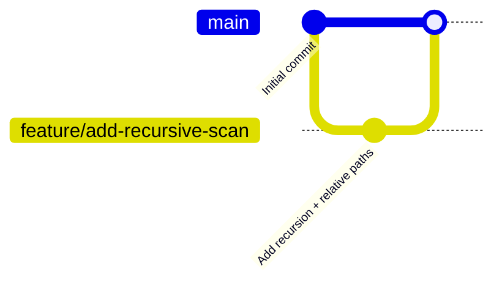

# **remo-dev**

[](https://www.python.org/downloads/)
[](https://github.com/Programming-Sai/remo-dev/actions/workflows/ci.yml)
[](LICENSE)

---

## 🚀 Overview

`remo-dev` is a Python script that monitors a directory (including subfolders) and logs every new file with its **filename, size (KB), and timestamp**. It persists state between runs using a JSON file, so only **new files** are reported each time, no duplicates.

This repository also demonstrates a complete **DevOps workflow**:

- **Git branching & pull request** with meaningful commit history
- **GitHub Actions CI** that runs `python -m py_compile` on every push to `main` as well as during a PR

---

## ✨ Features

- ✅ **Recursive scanning** – detects files in nested subdirectories (e.g., `project/src/utils/helper.py`)
- ✅ **Relative path storage** – handles duplicate filenames in different folders correctly
- ✅ **State persistence** – remembers previously seen files; only new ones are logged
- ✅ **Clean console output** – shows `NEW: path/to/file (size KB)` with a summary
- ✅ **Structured log file** – `log.txt` with consistent column alignment
- ✅ **Zero external dependencies** – uses only Python standard library

---

## 📦 Requirements

- Python 3.11 or higher (tested on 3.11, 3.12)

---

## 🔧 Installation

```bash
# Clone the repository
git clone https://github.com/Programming-Sai/remo-dev.git
cd remo-dev

# No extra packages needed – pure Python
```

---

## 🧪 Usage

```bash
python monitor.py <directory_to_watch>
```

### Examples

```bash
# Monitor a test folder
python monitor.py ./test_dir

# Monitor your current project source
python monitor.py ../my-project/src
```

### Sample Output

```
Scanning: ./test_dir
----------------------------------------
  NEW: readme.md (0.12 KB)
  NEW: src/main.py (4.56 KB)
  NEW: src/utils/helper.py (1.23 KB)
----------------------------------------
Total: 3 new file(s)
```

### Log File (`log.txt`)

```
[2026-05-21 10:30:01] readme.md                                        | 0.12 KB
[2026-05-21 10:30:01] src/main.py                                      | 4.56 KB
[2026-05-21 10:30:01] src/utils/helper.py                              | 1.23 KB
```

> [!NOTE]
> The script does **not** run as a daemon – it scans once per invocation. For continuous monitoring, combine with cron (Linux/macOS) or Task Scheduler (Windows).

---

## 📁 Project Structure

```
remo-dev/
├── .github/
│   └── workflows/
│       └── ci.yml                # GitHub Actions pipeline
├── .gitignore                    # Ignores logs, state, cache, test_dir
├── monitor.py                    # Main monitoring script
├── README.md                     # This file
├── .monitor_state.json           # Auto‑generated – tracks seen files
└── log.txt                       # Auto‑generated – output log
```

---

## ⚙️ CI/CD Pipeline

The repository includes a **GitHub Actions** workflow (`.github/workflows/ci.yml`) that:

- Triggers on **push to `main`** and **pull requests**
- Sets up Python 3.11
- Runs `python -m py_compile monitor.py` – a lightweight syntax check

This ensures every change is syntactically correct before merging.

---

## 🌿 Git Workflow Demonstration

This project showcases a clean Git branching strategy:



- A **feature branch** (`feature/add-recursive-scan`) was created from `main`
- Changes were made and tested locally
- A **pull request** was opened with a detailed description
- After review, the branch was merged into `main`
- The merge commit resolved a conflict (`.gitignore` + generator script removal)

See the [Pull Request](https://github.com/Programming-Sai/remo-dev/pull/1) for the full history.

---

## 🧪 Testing Locally

You can quickly test the script with a nested directory:

```bash
# Create a test structure
mkdir -p test_dir/level1/level2
echo "root" > test_dir/root.txt
echo "level1" > test_dir/level1/file1.txt
echo "level2" > test_dir/level1/level2/file2.txt

# First run – detects all three files
python monitor.py test_dir

# Second run – no new files detected
python monitor.py test_dir
```

---

## 🤝 Contributing

This project was created as a technical assessment. However, you are welcome to fork it and experiment:

1. Fork the repository
2. Create a feature branch (`git checkout -b feature/amazing`)
3. Commit your changes (`git commit -m 'Add amazing feature'`)
4. Push to the branch (`git push origin feature/amazing`)
5. Open a Pull Request

---
